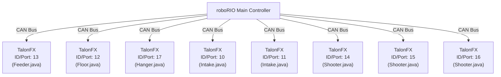

# Robot Hardware Wiring Diagram

```mermaid
graph TD
    rio[roboRIO Main Controller]
    dev_TalonFX_13["TalonFX<br/>ID/Port: 13<br/>(Feeder.java)"]
    rio -->|CAN Bus| dev_TalonFX_13
    dev_TalonFX_12["TalonFX<br/>ID/Port: 12<br/>(Floor.java)"]
    rio -->|CAN Bus| dev_TalonFX_12
    dev_TalonFX_17["TalonFX<br/>ID/Port: 17<br/>(Hanger.java)"]
    rio -->|CAN Bus| dev_TalonFX_17
    dev_TalonFX_10["TalonFX<br/>ID/Port: 10<br/>(Intake.java)"]
    rio -->|CAN Bus| dev_TalonFX_10
    dev_TalonFX_11["TalonFX<br/>ID/Port: 11<br/>(Intake.java)"]
    rio -->|CAN Bus| dev_TalonFX_11
    dev_TalonFX_14["TalonFX<br/>ID/Port: 14<br/>(Shooter.java)"]
    rio -->|CAN Bus| dev_TalonFX_14
    dev_TalonFX_15["TalonFX<br/>ID/Port: 15<br/>(Shooter.java)"]
    rio -->|CAN Bus| dev_TalonFX_15
    dev_TalonFX_16["TalonFX<br/>ID/Port: 16<br/>(Shooter.java)"]
    rio -->|CAN Bus| dev_TalonFX_16
```
